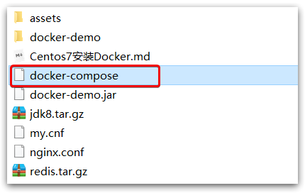

# 一、Docker的安装

查看系统的内核：

uname -r

系统内核版本为3.10.0

```shell
[root@iZwz99sm8v95sckz8bd2c4Z ~]# uname -r
3.10.0-957.21.3.el7.x86_64

```

查看系统配置

cat /etc/os-release

```shell
[root@iZwz99sm8v95sckz8bd2c4Z ~]# cat /etc/os-release
NAME="CentOS Linux"
VERSION="7 (Core)"
ID="centos"
ID_LIKE="rhel fedora"
VERSION_ID="7"
PRETTY_NAME="CentOS Linux 7 (Core)"
ANSI_COLOR="0;31"
CPE_NAME="cpe:/o:centos:centos:7"
HOME_URL="https://www.centos.org/"
BUG_REPORT_URL="https://bugs.centos.org/"

CENTOS_MANTISBT_PROJECT="CentOS-7"
CENTOS_MANTISBT_PROJECT_VERSION="7"
REDHAT_SUPPORT_PRODUCT="centos"
REDHAT_SUPPORT_PRODUCT_VERSION="7"

```

## Docker的安装步骤：

### **（1）卸载旧的版本**

```shell
yum remove docker \
                  docker-client \
                  docker-client-latest \
                  docker-common \
                  docker-latest \
                  docker-latest-logrotate \
                  docker-logrotate \
                  docker-engine

```

### **（2）下载需要的安装包**

```shell
yum install -y yum-utils

```

### **（3）设置镜像的仓库**

```shell
yum-config-manager \
    --add-repo \
    https://download.docker.com/linux/centos/docker-ce.repo  #国外的地址
    
    # 设置阿里云的Docker镜像仓库
yum-config-manager \
    --add-repo \
    https://mirrors.aliyun.com/docker-ce/linux/centos/docker-ce.repo  #国外的地址

```

### **（4）更新yum软件包索引**

```shell
yum makecache fast

```

### **（5）安装docker相关的配置**

docker-ce 是社区版，docker-ee 企业版

```shell
 yum install docker-ce docker-ce-cli containerd.io

```

出现了completed即安装成功。

### **（6）启动Docker**

```shell
systemctl start docker
# 查看当前版本号，是否启动成功
docker version
# 设置开机自启动
systemctl enable docker

```

结果：


下载hello-world镜像进行测试


查看下载的hello world镜像

```shell
[root@iZwz99sm8v95sckz8bd2c4Z lib]# docker images
REPOSITORY    TAG       IMAGE ID       CREATED         SIZE
hello-world   latest    bf756fb1ae65   11 months ago   13.3kB

```

## 2.Docker的卸载

```shell
# 1. 卸载依赖
yum remove docker-ce docker-ce-cli containerd.io
# 2. 删除资源  . /var/lib/docker是docker的默认工作路径
rm -rf /var/lib/docker

```

## 3.配置阿里云镜像加速

### **（1）进入阿里云官网，搜索容器镜像服务**


### **（2）依次执行官方的这四条命令**

```shell
sudo mkdir -p /etc/docker
sudo tee /etc/docker/daemon.json <<-'EOF'
{
  "registry-mirrors": ["https://axvfsf7e.mirror.aliyuncs.com"]
}
EOF
sudo systemctl daemon-reload
sudo systemctl restart docker

```


# 二、Docker常用命令

## 1.基础命令

```shell
docker version          #查看docker的版本信息
docker info             #查看docker的系统信息,包括镜像和容器的数量
docker 命令 --help       #帮助命令(可查看可选的参数)
docker COMMAND --help

```

命令的帮助文档地址:https://docs.docker.com/engine/reference/commandline/docker/

## 2.镜像命令

### （1）docker images 查看本地主机的所有镜像

```shell
[root@iZwz99sm8v95sckz8bd2c4Z ~]# docker images
REPOSITORY    TAG       IMAGE ID       CREATED         SIZE
hello-world   latest    bf756fb1ae65   11 months ago   13.3kB

#解释:
1.REPOSITORY  镜像的仓库源

2.TAG  镜像的标签

3.IMAGE ID 镜像的id

4.CREATED 镜像的创建时间

5.SIZE 镜像的大小

# 可选参数

-a/--all 列出所有镜像

-q/--quiet 只显示镜像的id

```

### （2）**docker search** 搜索镜像

```shell
[root@iZwz99sm8v95sckz8bd2c4Z ~]# docker search mysql
NAME                              DESCRIPTION                                     STARS     OFFICIAL   AUTOMATED
mysql                             MySQL is a widely used, open-source relation…   10308     [OK]
mariadb                           MariaDB is a community-developed fork of MyS…   3819      [OK]
mysql/mysql-server                Optimized MySQL Server Docker images. Create…   754                  [OK]
percona                           Percona Server is a fork of the MySQL relati…   517       [OK]
centos/mysql-57-centos7           MySQL 5.7 SQL database server                   86
mysql/mysql-cluster               Experimental MySQL Cluster Docker images. Cr…   79
centurylink/mysql                 Image containing mysql. Optimized to be link…   60                   [OK]


#可选参数

Search the Docker Hub for images

Options:
  -f, --filter filter   Filter output based on conditions provided
      --format string   Pretty-print search using a Go template
      --limit int       Max number of search results (default 25)
      --no-trunc        Don't truncate output
      
      
#搜索收藏数大于3000的镜像
[root@iZwz99sm8v95sckz8bd2c4Z ~]# docker search mysql --filter=STARS=3000
NAME      DESCRIPTION                                     STARS     OFFICIAL   AUTOMATED
mysql     MySQL is a widely used, open-source relation…   10308     [OK]
mariadb   MariaDB is a community-developed fordockerk of MyS…   3819      [OK]
```

### （3）**docker pull 镜像名[:tag]** 下载镜像

```shell
[root@iZwz99sm8v95sckz8bd2c4Z ~]# docker pull mysql
Using default tag: latest            #如果不写tag默认就是latest
latest: Pulling from library/mysql
6ec7b7d162b2: Pull complete          #分层下载,docker image的核心-联合文件系统
fedd960d3481: Pull complete
7ab947313861: Pull complete
64f92f19e638: Pull complete
3e80b17bff96: Pull complete
014e976799f9: Pull complete
59ae84fee1b3: Pull complete
ffe10de703ea: Pull complete
657af6d90c83: Pull complete
98bfb480322c: Pull complete
6aa3859c4789: Pull complete
1ed875d851ef: Pull complete
Digest: sha256:78800e6d3f1b230e35275145e657b82c3fb02a27b2d8e76aac2f5e90c1c30873 #签名
Status: Downloaded newer image for mysql:latest
docker.io/library/mysql:latest  #下载来源的真实地址  #docker pull mysql等价于docker pull docker.io/library/mysql:latest
```

#### 指定版本下载

```shell
[root@iZwz99sm8v95sckz8bd2c4Z ~]# docker pull mysql:5.7
5.7: Pulling from library/mysql
6ec7b7d162b2: Already exists
fedd960d3481: Already exists
7ab947313861: Already exists
64f92f19e638: Already exists
3e80b17bff96: Already exists
014e976799f9: Already exists
59ae84fee1b3: Already exists
7d1da2a18e2e: Pull complete
301a28b700b9: Pull complete
529dc8dbeaf3: Pull complete
bc9d021dc13f: Pull complete
Digest: sha256:c3a567d3e3ad8b05dfce401ed08f0f6bf3f3b64cc17694979d5f2e5d78e10173
Status: Downloaded newer image for mysql:5.7
docker.io/library/mysql:5.7

```

### （4）**docker rmi** 删除镜像

```shell
#1.删除指定的镜像id
[root@iZwz99sm8v95sckz8bd2c4Z ~]# docker rmi -f  镜像id
#2.删除多个镜像id
[root@iZwz99sm8v95sckz8bd2c4Z ~]# docker rmi -f  镜像id 镜像id 镜像id
#3.删除全部的镜像id
[root@iZwz99sm8v95sckz8bd2c4Z ~]# docker rmi -f  $(docker images -aq)

```

## 3.容器命令

### （1）如拉取一个centos容器

```shell
docker pull centos

```

### （2）运行容器

```shell
docker run [可选参数] image

#参数说明
--name="名字"           指定容器名字
-d                     后台方式运行
-it                    使用交互方式运行,进入容器查看内容
-p                     指定容器的端口
(
-p ip:主机端口:容器端口  配置主机端口映射到容器端口
-p 主机端口:容器端口
-p 容器端口
)
-P                     随机指定端口(大写的P)

```

```shell
[root@iZwz99sm8v95sckz8bd2c4Z ~]# docker run -it centos /bin/bash
[root@bd1b8900c547 /]# ls      
bin  dev  etc  home  lib  lib64  lost+found  media  mnt  opt  proc  root  run  sbin  srv  sys  tmp  usr  var

```

### （3）进入容器

在使用 **-d** 参数时，容器启动后会进入后台。此时想要进入容器，可以通过以下指令进入：

docker attach
docker exec：推荐大家使用 docker exec 命令，因为此退出容器终端，不会导致容器的停止。

``` shell
docker attach 1e560fca3906 
docker exec -it 243c32535da7 /bin/bash
```

### （4）退出容器

```shell
#exit 停止并退出容器（后台方式运行则仅退出）
#Ctrl+P+Q  不停止容器退出
[root@bd1b8900c547 /]# exit
exit
[root@iZwz99sm8v95sckz8bd2c4Z ~]#

```

### （5）列出运行过的容器

```shell
#docker ps 
     # 列出当前正在运行的容器
-a   # 列出所有容器的运行记录
-n=? # 显示最近创建的n个容器
-q   # 只显示容器的编号


[root@iZwz99sm8v95sckz8bd2c4Z ~]# docker ps
CONTAINER ID   IMAGE     COMMAND   CREATED   STATUS    PORTS     NAMES
[root@iZwz99sm8v95sckz8bd2c4Z ~]# docker ps -a
CONTAINER ID   IMAGE          COMMAND       CREATED         STATUS                     PORTS     NAMES
bca129320bb5   centos         "/bin/bash"   4 minutes ago   Exited (0) 3 minutes ago             optimistic_shtern
bd1b8900c547   centos         "/bin/bash"   6 minutes ago   Exited (0) 5 minutes ago             cool_tesla
cf6adbf1b506   bf756fb1ae65   "/hello"      5 hours ago     Exited (0) 5 hours ago               optimistic_darwin

```

### （6）删除容器

```shell
docker rm 容器id                 #删除指定的容器,不能删除正在运行的容器,强制删除使用 rm -f
docker rm -f $(docker ps -aq)   #删除所有的容器
docker ps -a -q|xargs docker rm #删除所有的容器

```


### （7）启动和停止容器

```shell
docker start 容器id          #启动容器
docker restart 容器id        #重启容器
docker stop 容器id           #停止当前运行的容器
docker kill 容器id           #强制停止当前容器

```

## 4. 其他常用命令

### （1）日志的查看：

```shell
[root@iZwz99sm8v95sckz8bd2c4Z ~]# docker logs --help

Usage:  docker logs [OPTIONS] CONTAINER

Fetch the logs of a container

Options:
      --details        Show extra details provided to logs
  -f, --follow         Follow log output
      --since string   Show logs since timestamp (e.g. 2013-01-02T13:23:37Z) or relative (e.g. 42m for 42 minutes)
  -n, --tail string    Number of lines to show from the end of the logs (default "all")
  -t, --timestamps     Show timestamps
      --until string   Show logs before a timestamp (e.g. 2013-01-02T13:23:37Z) or relative (e.g. 42m for 42 minutes)

常用：
docker logs -tf 容器id
docker logs --tail number 容器id #num为要显示的日志条数


#docker容器后台运行，必须要有一个前台的进程，否则会自动停止
#编写shell脚本循环执行，使得centos容器保持运行状态
[root@iZwz99sm8v95sckz8bd2c4Z ~]# docker run -d centos /bin/sh -c "while true;do echo hi;sleep 5;done"
c703b5b1911ff84d584390263a35707b6024816e1f46542b61918a6327a570dc
[root@iZwz99sm8v95sckz8bd2c4Z ~]# docker ps
CONTAINER ID   IMAGE     COMMAND                  CREATED          STATUS          PORTS     NAMES
c703b5b1911f   centos    "/bin/sh -c 'while t…"   13 seconds ago   Up 10 seconds             pedantic_banach
[root@iZwz99sm8v95sckz8bd2c4Z ~]# docker logs -tf --tail 10 c703b5b1911f
2020-12-27T03:34:07.255599560Z hi
2020-12-27T03:34:12.257641517Z hi
2020-12-27T03:34:17.259706294Z hi
2020-12-27T03:34:22.261693707Z hi
2020-12-27T03:34:27.262609289Z hi
2020-12-27T03:34:32.267862677Z hi
2020-12-27T03:34:37.270382873Z hi
2020-12-27T03:34:42.272414182Z hi
2020-12-27T03:34:47.274823243Z hi
2020-12-27T03:34:52.277419274Z hi

```


### （2）查看容器中进程信息

```shell
[root@iZwz99sm8v95sckz8bd2c4Z ~]# docker top c703b5b1911f
UID                 PID                 PPID                C                   STIME               TTY                 TIME                CMD
root                11156               11135               0                   11:31               ?                   00:00:00            /bin/sh -c while true;do echo hi;sleep 5;done
root                11886               11156               0                   11:43                ?                   00:00:00            /usr/bin/coreutils --coreutils-prog-shebang=sleep /usr/bin/sleep 5

```


### （3）查看容器的元数据

```shell
[root@iZwz99sm8v95sckz8bd2c4Z ~]# docker inspect 容器id
```

### （4）进入当前正在运行的容器

因为通常我们的容器都是使用后台方式来运行的，有时需要进入容器修改配置

#### 方式一：

```shell
[root@iZwz99sm8v95sckz8bd2c4Z ~]# docker exec -it c703b5b1911f /bin/bash
[root@c703b5b1911f /]# ls
bin  dev  etc  home  lib  lib64  lost+found  media  mnt  opt  proc  root  run  sbin  srv  sys  tmp  usr  var
[root@c703b5b1911f /]# ps -ef      
UID        PID  PPID  C STIME TTY          TIME CMD
root         1     0  0 03:31 ?        00:00:00 /bin/sh -c while true;do echo hi;sleep 5;done
root       279     0  0 03:54 pts/0    00:00:00 /bin/bash
root       315     1  0 03:56 ?        00:00:00 /usr/bin/coreutils --coreutils-prog-shebang=sleep /usr/bin/sleep 5
root       316   279  0 03:56 pts/0    00:00:00 ps -ef

```

### 方式二：

```shell
[root@iZwz99sm8v95sckz8bd2c4Z ~]# docker attach c703b5b1911f
```

docker exec 进入容器后开启一个新的终端，可以在里面操作

docker attach 进入容器正在执行的终端，不会启动新的进程

拷贝容器的文件到主机中

docker cp 容器id:容器内路径 目的主机路径

 ```shell
[root@iZwz99sm8v95sckz8bd2c4Z ~]# docker exec -it c703b5b1911f /bin/bash
[root@c703b5b1911f /]# cd home
[root@c703b5b1911f home]# ls
#touch 新建文件
[root@c703b5b1911f home]# touch test.java
[root@c703b5b1911f home]# ls
test.java
[root@c703b5b1911f home]# exit
exit
[root@iZwz99sm8v95sckz8bd2c4Z ~]# docker ps
CONTAINER ID   IMAGE     COMMAND                  CREATED          STATUS          PORTS     NAMES
c703b5b1911f   centos    "/bin/sh -c 'while t…"   35 minutes ago   Up 35 minutes             pedantic_banach
[root@iZwz99sm8v95sckz8bd2c4Z ~]# docker cp c703b5b1911f:/home/test.java /home
[root@iZwz99sm8v95sckz8bd2c4Z ~]# ls /home
hai  pan  test.java

 ```

## 5.命令小节的图解如下：


# 三、图形化管理工具Portaniner安装

Portaniner是Docker的图形化管理工具，类似的工具还有Rancher(CI/CD再用)

下载运行Portaniner镜像并运行，设置本机映射端口为8088

```shell
[root@localhost conf]# docker run -d -p 8088:9000 --restart=always -v /var/run/docker.sock:/var/run/docker.sock --privileged=true portainer/portainer
Unable to find image 'portainer/portainer:latest' locally
latest: Pulling from portainer/portainer
94cfa856b2b1: Pull complete
49d59ee0881a: Pull complete
a2300fd28637: Pull complete
Digest: sha256:fb45b43738646048a0a0cc74fcee2865b69efde857e710126084ee5de9be0f3f
Status: Downloaded newer image for portainer/portainer:latest
8c525a0137be22965bd1e3944da622a2c4248f8ad20883f4b3ea4f8a6b11e163
[root@iZwz99sm8v95sckz8bd2c4Z ~]# docker ps
CONTAINER ID   IMAGE                 COMMAND        CREATED         STATUS         PORTS                    NAMES
7789d4505a00   portainer/portainer   "/portainer"   6 seconds ago   Up 5 seconds   0.0.0.0:8088->9000/tcp   quirky_sinoussi

```

第一次登录设置admin用户的密码


如果是阿里云服务器记得设置安全组，选择连接本地的Docker,整体界面预览如下图：


# 四、容器数据卷

将应用和环境打包成一个镜像

数据都保存在容器中，如果容器被删除，数据就会丢失，需要数据持久化

数据需要存储在本地，容器之间可以有数据共享的技术

通过docker容器中产生的数据同步到本地，把容器删除，但是数据在本地，保证数据不会丢失

这就是容器数据卷技术，就是目录的挂载，将容器内的目录挂载到Linux上


## 数据集操作命令

数据卷操作的基本语法如下：

```sh
docker volume [COMMAND]
```

docker volume命令是数据卷操作，根据命令后跟随的command来确定下一步的操作：

- create 创建一个volume
- inspect 显示一个或多个volume的信息
- ls 列出所有的volume
- prune 删除未使用的volume
- rm 删除一个或多个指定的volume


### 创建和查看数据卷

**需求**：创建一个数据卷，并查看数据卷在宿主机的目录位置

① 创建数据卷

```sh
docker volume create html
```

② 查看所有数据

```sh
docker volume ls
```

结果：


③ 查看数据卷详细信息卷

```sh
docker volume inspect html
```

结果：


可以看到，我们创建的html这个数据卷关联的宿主机目录为`/var/lib/docker/volumes/html/_data`目录。

**小结**：

数据卷的作用：

- 将容器与数据分离，解耦合，方便操作容器内数据，保证数据安全

数据卷操作：

- docker volume create：创建数据卷
- docker volume ls：查看所有数据卷
- docker volume inspect：查看数据卷详细信息，包括关联的宿主机目录位置
- docker volume rm：删除指定数据卷
- docker volume prune：删除所有未使用的数据卷

### 挂载数据卷

我们在创建容器时，可以通过 -v 参数来挂载一个数据卷到某个容器内目录，命令格式如下：

```sh
docker run \
  --name mn \
  -v html:/root/html \
  -p 8080:80
  nginx \
```

这里的-v就是挂载数据卷的命令：

- `-v html:/root/htm` ：把html数据卷挂载到容器内的/root/html这个目录中

## 使用容器数据卷

### 命令

``` sh
docker run -it -v 主机内目录:容器内目录 镜像名/id
```

将容器内目录挂载到主机内目录上，通过**docker inspect [容器名或ID]**命令查看该容器即可以看到挂载信息：

``` shell
# 挂载命令
[root@iZ1608aqb7ntn9Z 20210806]# docker run -it -v /opt/Docker/20210806/:/opt centos /bin/bash

# 进入到容器内部
[root@e749444d0ee1 /]# cd opt/
[root@e749444d0ee1 opt]# ls -l
total 0
-rw-r--r-- 1 root root 0 Aug  6 03:35 ymx

# 查看本机
[root@iZ1608aqb7ntn9Z ~]# cd /opt/Docker/20210806/
[root@iZ1608aqb7ntn9Z 20210806]# ll
总用量 0
-rw-r--r-- 1 root root 0 8月   6 11:35 ymx 

# docker inspect [容器名或ID] 查看挂载
[root@iZ1608aqb7ntn9Z 20210806]# docker inspect e749444d0ee1 
......
     "Mounts": [
            {
                "Type": "bind",
                "Source": "/opt/Docker/20210806",  # 对应主机的源目录
                "Destination": "/opt",    # 容器中的目录
                "Mode": "",
                "RW": true,
                "Propagation": "rprivate"
            }
        ],
......

```

- source是主机内到地址
- destination是容器内的地址
- 在绑定的目录添加了文件，会同步到绑定的容器和主机的目录
- 就算容器停止了，也能同步过去
- 这样就解决了每次都要进入进入container更改配置的麻烦，只要添加了容器目录映射，就能在宿主机直接修改容器配置内容


## 实战MySQL

- 下载mysql
- 根据docker hub官方给出的方法来安装，需要映射文件夹，设置密码，设置container名字，

``` shell
docker run -d -p 3310:3306 --name mysql -v /home/mysql/conf:/etc/mysql/conf.d -v /home/mysql/data:/var/lib/mysql -e MYSQL_ROOT_PASSWORD=123456 -d mysql:5.7


-d 后台运行

-p 端口映射

-v 卷挂载

-e 环境配置

–name container name

–restart 启动docker 时就启动mysql

–privileged=true 提高权限

```

## 具名和匿名挂载

``` shell
-v 文件夹挂载
docker run -d -p --name nginx01 -v /ect/nginx nginx
#匿名挂载
#这里挂载的路径是container内的路径

docker volume ls
#查看所有volume的状况
#这个volume的路径在/var/lib/docker/volumes
#里面有着匿名的volume 有具名的volume


docker run -d -P --name nginx02 -v haoyun-nginx:/etc/nginx nginx
#具名挂载
#再查看volume情况里面会有使用具名设置的文件夹
local               haoyun-nginx

```

**目录内容，分匿名volume和具名volume**

``` shell
#区分具名、匿名、指定挂载路径
-v 容器内路径
#匿名挂载
-v 卷名：容器内路径
#具名挂载，开头没有斜杠
-v /宿主机路径：容器内路径
#指定挂载，完整路径

#后面还能接：ro：rw
#readOnly 只读
#readWrite 读写
docker run -d -P --name nginx02 -v haoyun-nginx:/etc/nginx:ro nginx
#只读  ro，只能通过宿主机来操作，容器内部无法操作

```

## 初始Dockerfile

docker就是挂载卷的第二种方法

通过build构建dockerfile的方式来创建image

通过在创建一个镜像的时候就实现volume 挂载mount

### 流程

- 创建dockerfile文件
- 使用docker build 命令
- 启动build 出的image
- 查看mound挂载文件夹的位置

### 实现

- 创建dockerfile 文件，选择一个路径，vim 直接新建编辑一个dockerfile文件

```shell
FROM centos

VOLUME ["volume01","volume02"]

CMD echo "---end---"
CMD /bin/bash

```

- 每个命令都是镜像的一层，具体如何制作dockerfile文件参考官方文档

```shell
docker build -f /home/docker-test/dockerfile1 -t kuangshen-centos:1.0 .
#使用docker build 构建dockerfile 
-f file string ，需要写入完整路径
--tag list Name and optionally a tag in the 'name:tag' format

#最后需要加加一个句号 .

```

- 构建时返回的参数如下

```shell
[root@localhost docker-test-volume]# docker build -f /home/docker-test/dockerfile1 -t kuangshen-centos:1.0 .
Sending build context to Docker daemon  2.048kB
Step 1/4 : FROM centos
 ---> 0d120b6ccaa8
Step 2/4 : VOLUME ["volume01","volume02"]
 ---> Running in 3e51013e5f64
Removing intermediate container 3e51013e5f64
 ---> 5e7d53b18c4f
Step 3/4 : CMD echo "---end---"
 ---> Running in a9a989920af9
Removing intermediate container a9a989920af9
 ---> ebd8b08be2f8
Step 4/4 : CMD /bin/bash
 ---> Running in 9b5648b024c7
Removing intermediate container 9b5648b024c7
 ---> aef2ceb5e4eb
Successfully built aef2ceb5e4eb
Successfully tagged haoyun-centos:1.0

```

- build是一句一句读取执行的

- 查看image

```shell
[root@localhost docker-test-volume]# docker images
REPOSITORY            TAG                 IMAGE ID            CREATED             SIZE
haoyun-centos         1.0                 aef2ceb5e4eb        21 seconds ago      215MB

```

- 启动 这个镜像

```shell
docker-test-volume]# docker run -it aef2ceb5e4eb /bin/bash

[root@e01d1b211d7b /]# ls
bin  dev  etc  home  lib  lib64  lost+found  media  mnt  opt  proc  root  run  sbin  srv  sys  tmp  usr  var  volume01	volume02
[root@e01d1b211d7b /]# 

#在dockerfile中挂载的两个mount volume已经在里面
#但是这个是     匿名挂载     要找到他的在宿主机的目录可以使用inspect查看

```

- docker inspect

```shell
docker inspect e01d1b211d7b
  "Mounts": [
            {
                "Type": "volume",
                "Name": "a7e3910d540c76c74f2d6755b44d5a8f9dcd4b0a6dc478d934a6a9143bcabd3a",
                "Source": "/var/lib/docker/volumes/a7e3910d540c76c74f2d6755b44d5a8f9dcd4b0a6dc478d934a6a9143bcabd3a/_data",
                "Destination": "volume01",
                "Driver": "local",
                "Mode": "",
                "RW": true,
                "Propagation": ""
            },
            {
                "Type": "volume",
                "Name": "35cab9f1fa5973072bf4861e692c6b6ef5e169a00c312af9618ad2aaaa7bf88d",
                "Source": "/var/lib/docker/volumes/35cab9f1fa5973072bf4861e692c6b6ef5e169a00c312af9618ad2aaaa7bf88d/_data",
                "Destination": "volume02",
                "Driver": "local",
                "Mode": "",
                "RW": true,
                "Propagation": ""
            }
        ],

```

- source选项就是挂载宿主机的目录，在container的volume1文件夹里创建一个测试文件，看看能不能在标记的路径找到

```shell
[root@localhost _data]# ls
voloume01.txt
[root@localhost _data]# pwd
/var/lib/docker/volumes/a7e3910d540c76c74f2d6755b44d5a8f9dcd4b0a6dc478d934a6a9143bcabd3a/_data
[root@localhost _data]#
```

 ### 数据卷容器

- 多个MySQL同步数据！

- 命名的容器挂载数据卷！


``` shell
--volumes-from list              Mount volumes from the specified container(s)
# 测试，我们通过刚才启动的
```


- 多个mysql实现数据共享

``` shell
➜  ~ docker run -d -p 3306:3306 -v /home/mysql/conf:/etc/mysql/conf.d -v /home/mysql/data:/var/lib/mysql -e MYSQL_ROOT_PASSWORD=123456 --name mysql01 mysql:5.7
➜  ~ docker run -d -p 3307:3306 -e MYSQL_ROOT_PASSWORD=123456 --name mysql02 --volumes-from mysql01  mysql:5.7
# 这个时候，可以实现两个容器数据同步！

```

容器之间的配置信息的传递，数据卷容器的生命周期一直持续到没有容器使用为止。

但是一旦你持久化到了本地，这个时候，本地的数据是不会删除的！

## Dockerfile

`dockerfile`是用来构建docker镜像的文件！命令参数脚本！

### 构建步骤：

1、 编写一个dockerfile文件

2、 docker build 构建称为一个镜像

3、 docker run运行镜像

4、 docker push发布镜像（DockerHub 、阿里云仓库)


很多官方镜像都是基础包，很多功能没有，我们通常会自己搭建自己的镜像！

官方既然可以制作镜像，那我们也可以！

### DockerFile构建过程

**基础知识：**

1、每个保留关键字(指令）都是必须是大写字母

2、执行从上到下顺序

3、#表示注释

4、每一个指令都会创建提交一个新的镜像曾，并提交！


Dockerfile是面向开发的，我们以后要发布项目，做镜像，就需要编写dockerfile文件，这个文件十分简单！

Docker镜像逐渐成企业交付的标准，必须要掌握！

DockerFile：构建文件，定义了一切的步骤，源代码

DockerImages：通过DockerFile构建生成的镜像，最终发布和运行产品。

Docker容器：容器就是镜像运行起来提供服务。

```shell
FROM				# 基础镜像，一切从这里开始构建
MAINTAINER			# 镜像是谁写的， 姓名+邮箱
RUN					# 镜像构建的时候需要运行的命令
ADD					# 步骤，tomcat镜像，这个tomcat压缩包！添加内容 添加同目录
WORKDIR				# 镜像的工作目录
VOLUME				# 挂载的目录
EXPOSE				# 保留端口配置
CMD					# 指定这个容器启动的时候要运行的命令，只有最后一个会生效，可被替代。
ENTRYPOINT			# 指定这个容器启动的时候要运行的命令，可以追加命令
ONBUILD				# 当构建一个被继承 DockerFile 这个时候就会运行ONBUILD的指令，触发指令。
COPY				# 类似ADD，将我们文件拷贝到镜像中
ENV					# 构建的时候设置环境变量！

```

### 实战测试

#### 创建一个自己的centos

```shell
# 1.编写Dockerfile文件
vim mydockerfile-centos
FROM centos
MAINTAINER kuang<1204598429@qq.com>

ENV MYPATH /usr/local
WORKDIR $MYPATH

RUN yum -y install vim
RUN yum -y install net-tools

EXPOSE 80

CMD echo $MYPATH
CMD echo "-----end----"
CMD /bin/bash

```

```shell
# 2、通过这个文件构建镜像
# 命令 docker build -f 文件路径 -t 镜像名:[tag] .
docker build -f mydockerfile-centos -t mycentos:0.1 .

#成功
Successfully built c0202533fc7f
Successfully tagged mycentos:0.1
```

#### 测试运行

```shell
[root@klstudy dockerfile]# docker run -it c0202533fc7f
[root@a6b7a9e4ee89 local]# ifconfig
eth0: flags=4163<UP,BROADCAST,RUNNING,MULTICAST>  mtu 1500
        inet 172.17.0.2  netmask 255.255.0.0  broadcast 172.17.255.255
        ether 02:42:ac:11:00:02  txqueuelen 0  (Ethernet)
        RX packets 6  bytes 516 (516.0 B)
        RX errors 0  dropped 0  overruns 0  frame 0
        TX packets 0  bytes 0 (0.0 B)
        TX errors 0  dropped 0 overruns 0  carrier 0  collisions 0

lo: flags=73<UP,LOOPBACK,RUNNING>  mtu 65536
        inet 127.0.0.1  netmask 255.0.0.0
        loop  txqueuelen 1000  (Local Loopback)
        RX packets 0  bytes 0 (0.0 B)
        RX errors 0  dropped 0  overruns 0  frame 0
        TX packets 0  bytes 0 (0.0 B)
        TX errors 0  dropped 0 overruns 0  carrier 0  collisions 0

[root@a6b7a9e4ee89 local]# pwd
/usr/local
```

#### 查看历史

```shell
[root@klstudy dockerfile]# docker history c0202533fc7f
IMAGE          CREATED         CREATED BY                                      SIZE      COMMENT
c0202533fc7f   4 minutes ago   /bin/sh -c #(nop)  CMD ["/bin/sh" "-c" "/bin…   0B        
78eaa47fec1c   4 minutes ago   /bin/sh -c #(nop)  CMD ["/bin/sh" "-c" "echo…   0B        
ec592d008a44   4 minutes ago   /bin/sh -c #(nop)  CMD ["/bin/sh" "-c" "echo…   0B        
9a88c0e13e14   4 minutes ago   /bin/sh -c #(nop)  EXPOSE 80                    0B        
cf064151d6a7   4 minutes ago   /bin/sh -c yum -y install net-tools             30.5MB    
c9c8fa967a34   4 minutes ago   /bin/sh -c yum -y install vim                   69.5MB    
f47ec07c420d   5 minutes ago   /bin/sh -c #(nop) WORKDIR /usr/local            0B        
cbaf5809c981   5 minutes ago   /bin/sh -c #(nop)  ENV MYPATH=/usr/local        0B        
26dfd379137a   5 minutes ago   /bin/sh -c #(nop)  MAINTAINER kuang<17414615…   0B        
300e315adb2f   9 months ago    /bin/sh -c #(nop)  CMD ["/bin/bash"]            0B        
<missing>      9 months ago    /bin/sh -c #(nop)  LABEL org.label-schema.sc…   0B        
<missing>      9 months ago    /bin/sh -c #(nop) ADD file:bd7a2aed6ede423b7…   209MB  
```

#### CMD 和 ENTRYPOINT区别

```shell
CMD					# 指定这个容器启动的时候要运行的命令，只有最后一个会生效，可被替代。
ENTRYPOINT			# 指定这个容器启动的时候要运行的命令，可以追加命令
```

**测试cmd**

```shell
# 编写dockerfile文件
$ vim dockerfile-test-cmd
FROM centos
CMD ["ls","-a"]
# 构建镜像
$ docker build  -f dockerfile-test-cmd -t cmd-test:0.1 .
# 运行镜像
$ docker run cmd-test:0.1
.
..
.dockerenv
bin
dev

# 想追加一个命令  -l 成为ls -al
$ docker run cmd-test:0.1 -l
docker: Error response from daemon: OCI runtime create failed: container_linux.go:349: starting container process caused "exec: \"-l\":
 executable file not found in $PATH": unknown.
ERRO[0000] error waiting for container: context canceled 
# cmd的情况下 -l 替换了CMD["ls","-l"]。 -l  不是命令所有报错
```

**测试ENTRYPOINT**

```shell
# 编写dockerfile文件
$ vim dockerfile-test-entrypoint
FROM centos
ENTRYPOINT ["ls","-a"]
$ docker run entrypoint-test:0.1
.
..
.dockerenv
bin
dev
etc
home
lib
lib64
lost+found ...
# 我们的命令，是直接拼接在我们得ENTRYPOINT命令后面的
$ docker run entrypoint-test:0.1 -l
total 56
drwxr-xr-x   1 root root 4096 May 16 06:32 .
drwxr-xr-x   1 root root 4096 May 16 06:32 ..
-rwxr-xr-x   1 root root    0 May 16 06:32 .dockerenv
lrwxrwxrwx   1 root root    7 May 11  2019 bin -> usr/bin
drwxr-xr-x   5 root root  340 May 16 06:32 dev
drwxr-xr-x   1 root root 4096 May 16 06:32 etc
drwxr-xr-x   2 root root 4096 May 11  2019 home
lrwxrwxrwx   1 root root    7 May 11  2019 lib -> usr/lib
lrwxrwxrwx   1 root root    9 May 11  2019 lib64 -> usr/lib64 ....
```

Dockerfile中很多命令都十分的相似，我们需要了解它们的区别，我们最好的学习就是对比他们然后测试效果！

### 实战：Tomcat镜像

1、准备镜像文件

 准备tomcat 和 jdk到当前目录，编写好README

```shell
[root@klstudy kuang]# ls
apache-tomcat-8.5.59.tar.gz  Dockerfile  jdk-8u261-linux-x64.tar.gz  README
```

2、编写Dokerfile

```shell
FROM centos #
MAINTAINER kuang<1741461577@qq.com>
COPY README /usr/local/README #复制文件
ADD jdk-8u261-linux-x64.tar.gz /usr/local/ #复制解压
ADD apache-tomcat-8.5.59.tar.gz /usr/local/ #复制解压
RUN yum -y install vim
ENV MYPATH /usr/local #设置环境变量
WORKDIR $MYPATH #设置工作目录
ENV JAVA_HOME /usr/local/jdk1.8.0_261 #设置环境变量
ENV CATALINA_HOME /usr/local/apache-tomcat-8.5.59 #设置环境变量
ENV CATALINA_BASH /usr/local/apache-tomcat-8.5.59 #设置环境变量
ENV PATH $PATH:$JAVA_HOME/bin:$CATALINA_HOME/lib #设置环境变量 分隔符是：
EXPOSE 8080 #设置暴露的端口
CMD /usr/local/apache-tomcat-8.5.59/bin/startup.sh && tail -F /usr/local/apache-tomcat-8.5.59/logs/catalina.out # 设置默认命令
```

3、构建镜像

```shell
# 因为dockerfile命名使用默认命名 因此不用使用-f 指定文件
$ docker build -t mytomcat:0.1 .
```

4、run镜像

```shell
$ docker run -d -p 9090:8080 --name tomcat01 -v /home/kuang/test:/usr/local/apache-tomcat-8.5.59/webapps/test -v /home/kuang/tomcatlogs/:/usr/local/apache-tomcat-8.5.59/logs mytomcat:0.1
```

5、访问测试

6、发布项目(由于做了卷挂载，我们直接在本地编写项目就可以发布了！)

发现：项目部署成功，可以直接访问！

我们以后开发的步骤：需要掌握Dockerfile的编写！我们之后的一切都是使用docker镜像来发布运行！

## 发布自己的镜像

### Dockerhub

1、地址 https://hub.docker.com/

2、确定这个账号可以登录

3、登录

```shell
$ docker login --help
Usage:  docker login [OPTIONS] [SERVER]

Log in to a Docker registry.
If no server is specified, the default is defined by the daemon.

Options:
  -p, --password string   Password
      --password-stdin    Take the password from stdin
  -u, --username string   Username
```

4、提交 push镜像


```shell
# 会发现push不上去，因为如果没有前缀的话默认是push到 官方的library
# 解决方法
# 第一种 build的时候添加你的dockerhub用户名，然后在push就可以放到自己的仓库了
$ docker build -t chengcoder/mytomcat:0.1 .
# 第二种 使用docker tag #然后再次push
$ docker tag 容器id chengcoder/mytomcat:1.0 #然后再次push
```

### 阿里云镜像服务上

看官网 很详细https://cr.console.aliyun.com/repository/

```shell
$ sudo docker login --username=zchengx registry.cn-shenzhen.aliyuncs.com
$ sudo docker tag [ImageId] registry.cn-shenzhen.aliyuncs.com/dsadxzc/cheng:[镜像版本号]
# 修改id 和 版本
sudo docker tag a5ef1f32aaae registry.cn-shenzhen.aliyuncs.com/dsadxzc/cheng:1.0
# 修改版本
$ sudo docker push registry.cn-shenzhen.aliyuncs.com/dsadxzc/cheng:[镜像版本号]
```

### 小结


# Docker 网络

### 理解Docker 0


### 原理

1、我们每启动一个docker容器，docker就会给docker容器分配一个ip，我们只要按照了docker，就会有一个docker0桥接模式，使用的技术是veth-pair技术！

https://www.cnblogs.com/bakari/p/10613710.html


2 、在启动一个容器测试，发现又多了一对网络


```shell
# 我们发现这个容器带来网卡，都是一对对的
# veth-pair 就是一对的虚拟设备接口，他们都是成对出现的，一端连着协议，一端彼此相连
# 正因为有这个特性 veth-pair 充当一个桥梁，连接各种虚拟网络设备的
# OpenStac,Docker容器之间的连接，OVS的连接，都是使用evth-pair技术
```

3、我们来测试下tomcat01和tomcat02是否可以ping通

```shell
$ docker-tomcat docker exec -it tomcat01 ip addr  #获取tomcat01的ip 172.17.0.2   
550: eth0@if551: <BROADCAST,MULTICAST,UP,LOWER_UP> mtu 1500 qdisc noqueue state UP group default 
    link/ether 02:42:ac:11:00:02 brd ff:ff:ff:ff:ff:ff link-netnsid 0
    inet 172.17.0.2/16 brd 172.17.255.255 scope global eth0
       valid_lft forever preferred_lft forever
$ docker-tomcat docker exec -it tomcat02 ping 172.17.0.2#让tomcat02ping tomcat01 
PING 172.17.0.2 (172.17.0.2) 56(84) bytes of data.
64 bytes from 172.17.0.2: icmp_seq=1 ttl=64 time=0.098 ms
64 bytes from 172.17.0.2: icmp_seq=2 ttl=64 time=0.071 ms
# 可以ping通

```


结论：tomcat01和tomcat02公用一个路由器，docker0。

所有的容器不指定网络的情况下，都是docker0路由的，docker会给我们的容器分配一个默认的可用ip。

### 小结：

Docker使用的是Linux的桥接，宿主机是一个Docker容器的网桥 docker0


Docker中所有网络接口都是虚拟的，虚拟的转发效率高（内网传递文件）

只要容器删除，对应的网桥一对就没了！


### –link

```shell
$ docker exec -it tomcat02 ping tomca01   # ping不通
ping: tomca01: Name or service not known
# 运行一个tomcat03 --link tomcat02 
$ docker run -d -P --name tomcat03 --link tomcat02 tomcat
5f9331566980a9e92bc54681caaac14e9fc993f14ad13d98534026c08c0a9aef
# 用tomcat03 ping tomcat02 可以ping通
$ docker exec -it tomcat03 ping tomcat02
PING tomcat02 (172.17.0.3) 56(84) bytes of data.
64 bytes from tomcat02 (172.17.0.3): icmp_seq=1 ttl=64 time=0.115 ms
64 bytes from tomcat02 (172.17.0.3): icmp_seq=2 ttl=64 time=0.080 ms

# 用tomcat02 ping tomcat03 ping不通
```

**探究：**

docker network inspect 网络id 网段相同


docker inspect tomcat03


查看tomcat03里面的/etc/hosts发现有tomcat02的配置


–link 本质就是在hosts配置中添加映射

现在使用Docker已经不建议使用–link了！

自定义网络，不适用docker0！

docker0问题：不支持容器名连接访问！

### 自定义网络

```shell
docker network
connect     -- Connect a container to a network
create      -- Creates a new network with a name specified by the
disconnect  -- Disconnects a container from a network
inspect     -- Displays detailed information on a network
ls          -- Lists all the networks created by the user
prune       -- Remove all unused networks
rm          -- Deletes one or more networks
```

> 查看所有的docker网络


**网络模式**

bridge ：桥接 docker（默认，自己创建也是用bridge模式）

none ：不配置网络，一般不用

host ：和所主机共享网络

container ：容器网络连通（用得少！局限很大）

测试

```shell
# 我们直接启动的命令 --net bridge,而这个就是我们得docker0
# bridge就是docker0
$ docker run -d -P --name tomcat01 tomcat
等价于 => docker run -d -P --name tomcat01 --net bridge tomcat

# docker0，特点：默认，域名不能访问。 --link可以打通连接，但是很麻烦！
# 我们可以 自定义一个网络
# --driver
#--subnet 192.168.0.0/16
#--gateway 192.168.0.1
$ docker network create --driver bridge --subnet 192.168.0.0/16 --gateway 192.168.0.1 mynet
```


```shell
$ docker network inspect mynet;
```


启动两个tomcat,再次查看网络情况

```shell
docker run -d -P --name tomcat-net-01 --net mynet tomcat
docker run -d -P --name tomcat-net-02 --net mynet tomcat
```


在自定义的网络下，服务可以通过**名字**和**ip地址**互相ping通，不用使用–link


我们自定义的网络docker当我们维护好了对应的关系，推荐我们平时这样使用网络！

好处：

redis -不同的集群使用不同的网络，保证集群是安全和健康的

mysql-不同的集群使用不同的网络，保证集群是安全和健康的


### 网络连通


```shell
# 测试两个不同的网络连通  再启动两个tomcat 使用默认网络，即docker0
$ docker run -d -P --name tomcat01 tomcat
$ docker run -d -P --name tomcat02 tomcat
# 此时ping不通
```


```shell
# 要将tomcat01 连通 tomcat—net-01 ，连通就是将 tomcat01加到 mynet网络
# 一个容器两个ip（tomcat01）
```


```shell
# 01连通 ，加入后此时，已经可以tomcat01 和 tomcat-01-net ping通了
# 02是依旧不通的
```

结论：假设要跨网络操作别人，就需要使用docker network connect 连通！

### 实战：部署Redis集群


```shell
# 创建网卡
docker network create redis --subnet 172.38.0.0/16
# 通过脚本创建六个redis配置
for port in $(seq 1 6);\
do \
mkdir -p /mydata/redis/node-${port}/conf
touch /mydata/redis/node-${port}/conf/redis.conf
cat << EOF >> /mydata/redis/node-${port}/conf/redis.conf
port 6379
bind 0.0.0.0
cluster-enabled yes
cluster-config-file nodes.conf
cluster-node-timeout 5000
cluster-announce-ip 172.38.0.1${port}
cluster-announce-port 6379
cluster-announce-bus-port 16379
appendonly yes
EOF
done

# 通过脚本运行六个redis
for port in $(seq 1 6);\
docker run -p 637${port}:6379 -p 1667${port}:16379 --name redis-${port} \
-v /mydata/redis/node-${port}/data:/data \
-v /mydata/redis/node-${port}/conf/redis.conf:/etc/redis/redis.conf \
-d --net redis --ip 172.38.0.1${port} redis:5.0.9-alpine3.11 redis-server /etc/redis/redis.conf
docker exec -it redis-1 /bin/sh #redis默认没有bash
redis-cli --cluster create 172.38.0.11:6379 172.38.0.12:6379 172.38.0.13:6379 172.38.0.14:6379 172.38.0.15:6379 172.38.0.16:6379  --cluster-replicas 1
```


docker搭建redis集群完成！


[外链图片转存失败,源站可能有防盗链机制,建议将图片保存下来直接上传(img-i60F3UA4-1589635687509)(C:/Users/xiao/Pictures/md/image-20200516203010672.png)]

我们使用docker之后，所有的技术都会慢慢变得简单起来！

# SpringBoot微服务打包Docker镜像

1、构建SpringBoot项目

2、打包运行

```shell
mvn package
```

3、编写dockerfile

```shell
FROM java:8
COPY *.jar /app.jar
CMD ["--server.port=8080"]
EXPOSE 8080
ENTRYPOINT ["java","-jar","app.jar"]
```

4、构建镜像

```shell
# 1.复制jar和DockerFIle到服务器
# 2.构建镜像
$ docker build -t xxxxx:xx  .
```

5、发布运行

以后我们使用了Docker之后，给别人交付就是一个镜像即可！

# 安装DockerCompose

## 1.下载

Linux下需要通过命令下载：

```sh
# 安装
curl -L https://github.com/docker/compose/releases/download/1.23.1/docker-compose-`uname -s`-`uname -m` > /usr/local/bin/docker-compose
```

如果下载速度较慢，或者下载失败，可以使用课前资料提供的docker-compose文件：



上传到`/usr/local/bin/`目录也可以。


## 2.修改文件权限

修改文件权限：

```sh
# 修改权限
chmod +x /usr/local/bin/docker-compose
```


## 3.Base自动补全命令：

```sh
# 补全命令
curl -L https://raw.githubusercontent.com/docker/compose/1.29.1/contrib/completion/bash/docker-compose > /etc/bash_completion.d/docker-compose
```

如果这里出现错误，需要修改自己的hosts文件：

```sh
echo "199.232.68.133 raw.githubusercontent.com" >> /etc/hosts
```

### 4.部署

最后，我们需要将文件整个cloud-demo文件夹上传到虚拟机中，利用DockerCompose部署。

上传到任意目录：


部署：

进入cloud-demo目录，然后运行下面的命令：

```sh
docker-compose up -d
```


# Docker镜像仓库

搭建镜像仓库可以基于Docker官方提供的DockerRegistry来实现。

官网地址：https://hub.docker.com/_/registry

## 1.简化版镜像仓库

Docker官方的Docker Registry是一个基础版本的Docker镜像仓库，具备仓库管理的完整功能，但是没有图形化界面。

搭建方式比较简单，命令如下：

```sh
docker run -d \
    --restart=always \
    --name registry	\
    -p 5000:5000 \
    -v registry-data:/var/lib/registry \
    registry
```


命令中挂载了一个数据卷registry-data到容器内的/var/lib/registry 目录，这是私有镜像库存放数据的目录。

访问http://YourIp:5000/v2/_catalog 可以查看当前私有镜像服务中包含的镜像


## 2.带有图形化界面版本

使用DockerCompose部署带有图象界面的DockerRegistry，命令如下：

```yaml
version: '3.0'
services:
  registry:
    image: registry
    volumes:
      - ./registry-data:/var/lib/registry
  ui:
    image: joxit/docker-registry-ui:static
    ports:
      - 8080:80
    environment:
      - REGISTRY_TITLE=传智教育私有仓库
      - REGISTRY_URL=http://registry:5000
    depends_on:
      - registry
```


## 3.配置Docker信任地址

我们的私服采用的是http协议，默认不被Docker信任，所以需要做一个配置：

```sh
# 打开要修改的文件
vi /etc/docker/daemon.json
# 添加内容：
"insecure-registries":["http://192.168.150.101:8080"]
# 重加载
systemctl daemon-reload
# 重启docker
systemctl restart docker
```

部署

```shell
docker-compose up -d
```

## 4.推送、拉取镜像

推送镜像到私有镜像服务必须先tag，步骤如下：

① 重新tag本地镜像，名称前缀为私有仓库的地址：192.168.150.101:8080/

 ```sh
docker tag nginx:latest 192.168.150.101:8080/nginx:1.0 
 ```

② 推送镜像

```sh
docker push 192.168.150.101:8080/nginx:1.0 
```

③ 拉取镜像

```sh
docker pull 192.168.150.101:8080/nginx:1.0 
```


