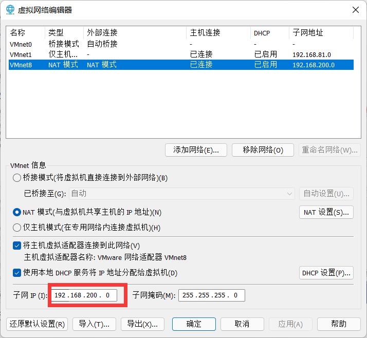

linux命令

## Linux 目录结构

1. /bin [常用] （usr/bin     /usr/local/bin）

   是 Binary 的缩写。这个目录存放着最经常使用的命令。

2. /sbin    (/usr/sbin       /usr/local/sbin)

   s 就是 Super User 的意思，这里存放的是系统管理员使用的系统管理程序。

3. /home [常用]

   存放普通用户的主目录，在 Linux 中每个用户都有一个自己的目录，一般该目录名是以用户的账号命名。

4. /root [常用]

   该目录为系统管理员，也称作超级权限者的用户主目录

5. /lib 

   系统开机所需要最基本的动态连接共享库，其作用类似于 Windows 里的 DLL 文件。几乎所有的应用程序都需要用到这些共享库

6. /lost+found 

   这个目录一般情况下是空的，当系统非法关机后，这里就存放了一些文件

7. /etc [常用]

   所有的系统管理所需要的配置文件和子目录, 比如安装 mysql 数据库 my.conf

8.  /usr [常用]

   这是一个非常重要的目录，用户的很多应用程序和文件都放在这个目录下，类似与 windows 下的 program files 目录。

9. /boot [常用]

   存放的是启动 Linux 时使用的一些核心文件，包括一些连接文件以及镜像文件

10.  /proc [不能动]

     这个目录是一个虚拟的目录，它是系统内存的映射，访问这个目录来获取系统信息

11. /srv [不能动] 

    service 缩写，该目录存放一些服务启动之后需要提取的数据

12. /sys [不能动]

    这是 linux2.6 内核的一个很大的变化。该目录下安装了 2.6 内核中新出现的一个文件系统 sysfs ->[别动]

13. /tmp 

    这个目录是用来存放一些临时文件的

14.  /dev

    类似于 windows 的设备管理器，把所有的硬件用文件的形式存储

15. /media [常用]

     linux 系统会自动识别一些设备，例如 U 盘、光驱等等，当识别后，linux 会把识别的设备挂载到这个目录下

16. /mnt [常用]

    系统提供该目录是为了让用户临时挂载别的文件系统的，我们可以将外部的存储挂载在/mnt/上，然后进入该目录就可以查看里的内容了。d:/myshare

17. /opt

     这是给主机额外安装软件所存放的目录。如安装 ORACLE 数据库就可放到该目录下。默认为空

18. /usr/local [常用]

    这是另一个给主机额外安装软件所安装的目录。一般是通过编译源码方式安装的程序

19. /var [常用]

    这个目录中存放着在不断扩充着的东西，习惯将经常被修改的目录放在这个目录下。包括各种日志文件

20. /selinux [security-enhanced linux]

    SELinux 是一种安全子系统,它能控制程序只能访问特定文件, 有三种工作模式，可以自行设置


​    
## Vi 和 Vim 编辑器

### 1.Vi 和 Vim 的常用的三种模式

- **正常模式**

  以 vim 打开一个档案就直接进入一般模式了(这是默认的模式)。在这个模式中， 你可以使用『上下左右』按键来移动光标，你可以使用『删除字符』或『删除整行』来处理档案内容， 也可以使用『复制、粘贴』来处理你的文件数据。

- **插入模式**

  按下 i, I, o, O, a, A, r, R 等任何一个字母之后才会进入编辑模式, 一般来说按 i 即可。

-  **命令行模式**

  输入 esc 再输入：在这个模式当中， 可以提供你相关指令，完成读取、存盘、替换、离开 vim、显示行号等的动作则是在此模式中达成的！

### 2.Vi 和 Vim 的基本使用

使用 Vim 开发一个 Hello.java 程序，

保存步骤说明和演示终端输入 vim Hello.java

i 开始编辑

esc 退出编辑

输入:wq 保存退出

### 3.各种模式的相互切换


### 4.Vi 和 vim 快捷键

- 拷贝当前行

  yy , 拷贝当前行向下的 5 行 5yy，并粘贴（输入 p）。

- 删除当前行 

  dd , 删除当前行向下的 5 行 5dd

- 在文件中查找某个单词 [命令行下 /关键字 ， 回车 查找 , 输入 n 就是查找下一个 ]

- 设置文件的行号，取消文件的行号.[命令行下 : set nu 和 :set nonu]

- 编辑 /etc/profile 文件，在一般模式下, 使用快捷键到该文档的最末行[G]和最首行[gg]

- 在一个文件中输入 "hello" ,在一般模式下, 然后又撤销这个动作 u

- 编辑 /etc/profile 文件，在一般模式下, 并将光标移动到 , 输入 20,再输入 shift+g

  

## 开机、重启和用户登录注销

###  关机&重启指令

- shutdown –h now    立该进行关机

- shudown -h 1          "hello, 1 分钟后会关机了"

- shutdown –r now     现在重新启动计算机

- shutdown                 "hello, 1 分钟后会关机了"

- halt                           关机，作用和上面一样

- reboot                      现在重新启动计算机

- sync                          把内存的数据同步到磁盘

  **注意细节**

  - 不管是重启系统还是关闭系统，首先要运行 sync 命令，把内存中的数据写到磁盘中
  - 目前的 shutdown/reboot/halt 等命令均已经在关机前进行了 sync 


### 用户登录和注销

- 登录时尽量少用 root 帐号登录，因为它是系统管理员，最大的权限，避免操作失误。可以利用普通用户登录，登录后再用”su - 用户名’命令来切换成系统管理员身份

- 在提示符下输入 logout 即可注销用户

  **注意细节**

  - logout 注销指令在图形运行级别无效，在运行级别 3 下有效。

##  用户管理

#### 1.添加用户，查询用户信息

- **添加用户**

  - useradd  用户名

  添加一个用户 milan, 默认该用户的家目录在 /home/milan

  当创建用户成功后，会自动的创建和用户同名的家目录

  也可以通过 useradd -d 指定目录新的用户名，给新创建的用户指定家目录

- **指定/修改密码**

  - passwd 用户名

  删除用户 milan，但是要保留家目录, userdel milan

  删除用户以及用户主目录, 比如 tom, userdel -r tom

- **查询用户信息指令**

  - id 用户名

-  **查看当前用户/登录用户**

  **whoami/who am i**

#### 2.用户组

- **新增组**

  groupadd 组名

- **删除组**

  groupdel 组名

- **案例演示**

  增加用户时直接加上组

  **useradd –g 用户组 用户名**

- **修改用户的组**

  usermod -g 用户组 用户名

#### **3.用户组和相关文件**

- **/etc/passwd 文件**

  用户（user）的配置文件，记录用户的各种信息

  每行的含义：用户名:口令:用户标识号:组标识号:注释性描述:主目录:登录 Shell

-  **/etc/shadow 文件**

  口令的配置文件

  每行的含义：登录名:加密口令:最后一次修改时间:最小时间间隔:最大时间间隔:警告时间:不

  活动时间:失效时间:标志

- **/etc/group 文件**

  组(group)的配置文件，记录 Linux 包含的组的信息

  每行含义：组名:口令:组标识号:组内用户列表

## 实用指令

#### 1.指定运行级别

- 命令：init [0123456]

- 运行级别说明：

  0：关机

  1：单用户【找回丢失密码】

  2：多用户状态没有网络服务

  3：多用户状态有网络服务

  4：系统未使用保留给用户

  5：图形界面

  6：系统重启

  常用运行级别是 3 和 5，也可以指定默认运行级别

- CentOS7 后运行级别说明

  在 centos7 以前， /etc/inittab 文件中 .

  进行了简化 ，如下:

  **multi-user.target**: analogous to runlevel 3

  **graphical.target**: analogous to runlevel 5

  \# To view current default target, run:

  **systemctl get-default**

   #To set a default target, run:

  **systemctl set-default TARGET.target**

#### 2.找回 ROOT 密码

linux 找回 root 密码（CentOS7.6）

1.启动系统，进入开机页面，在界面中按“e”进入编辑页面。如图


2.进入编辑页面，使用键盘的上下把光标往下移动，找到以“Linux16”开头内容所在的行数，在行的最后面输入：init=/bin/sh，如图


3.接着，输入完成后，直接按快捷键：Ctrl+x 进入单用户模式。接着，在光标闪烁的位置中输入：mount -o remount,rw /（注意：各个单词间有空格），完成后按键盘的回车键（Enter）。如图


4.在新的一行最后面输入：passwd， 完成后按键盘的回车键（Enter）。输入密码，然后再次确认密码即可。密码修改成功后，会显示 passwd.....的样式，说明密码修改成功


5.接着，在鼠标闪烁的位置中（最后一行中）输入：touch /.autorelabel（注意：touch 与 /后面有一个空格），完成后按键盘的回车键（Enter）继续在光标闪烁的位置中，输入：exec /sbin/init（注意：exec 与 /后面有一个空格，完成后按键盘的回车键（Enter）,等待系统自动修改密码(提示：这个过程时间可能有点长，耐心等待)，完成后，系统会自动重启, 新的密码生效了


#### 3.帮助指令

- **man 获得信息帮助**

  基本语法：

  ​	man [命令或配置文件]（功能描述：获得帮助信息）

  案例：查看 ls 命令的帮助信息 man ls

  在 linux 下，隐藏文件是以 .开头 , 选项可以组合使用 比如 ls -al, 比如 ls -al /root

- **help 指令**

  基本语法：
  
  ​	help 命令 （功能描述：获得 shell 内置命令的帮助信息）

####  4.文件目录类

- **pwd 指令**

  基本语法:  

  ​	pwd

- **ls 指令**

  基本语法: 

  ​	ls [选项] [目录或是文件]

  -a：显示当前目录所有的文件和目录，包括是隐藏的。

  -l：以列表的方式显示信息应用实例

  -h：以MB显示

- **cd 指令**

  基本语法: 

  ​	cd [参数] (功能描述：切换到指定目录)

  cd ~ 或者 cd：回到自己的家目录, 比如 你是 root，cd ~ 到 /root

  cd .. 回到当前目录的上一级目录

- **mkdir 指令**

  基本语法: 

  ​	mkdir [选项] 要创建的目录

  -p：创建多级目录

- **touch 命令**

  基本语法: 

  ​	touch 文件名称

- **rmdir 指令删除空目录**

  基本语法: 

  ​	rmdir [选项] 要删除的空目录

- **cp 指令**

  基本语法: 

  ​	cp [选项] source dest

  -r：递归复制整个文件夹

- **rm 指令**

  基本语法: 

  ​	rm [选项] 要删除的文件或目录

  -r：递归删除整个文件夹

  -f：强制删除不提示

  **删库跑路：rm -rf /\***

- **mv 指令**

  基本语法: 

  ​	mv oldNameFile newNameFile

- **cat指令**

  基本语法:  

  ​	cat [选项] 要查看的文件

- **more指令**

  more 要查看的文件

| 操作            | 功能说明                             |
| --------------- | ------------------------------------ |
| 空格键（space） | 代表向下翻一页                       |
| enter           | 代表向下翻一行                       |
| q               | 代表立刻离开more，不再显示该文件内容 |
| ctrl+f          | 向下滚动一屏                         |
| ctrl+b          | 返回上一屏                           |
| =               | 输出当前行的行号                     |
| :f              | 输出文件名和当前的行号               |

-  **less指令**

  基本语法:  

  ​	less 要查看的文件

| 操作            | 功能说明                                     |
| --------------- | -------------------------------------------- |
| 空格键（space） | 向下翻动一页                                 |
| pagedown        | 向下翻动一页                                 |
| pageup          | 向上翻动一页                                 |
| /字串           | 向下搜寻字串的功能；n：向下查找；N：向上查找 |
| ?字串           | 向上搜寻字串的功能；n：向上查找；N：向下查找 |
| q               | 离开less这个程序                             |

-  **echo指令**

  基本语法：

  ​	echo [选项] [输出内容]

-  **head指令**

  基本语法：

  ​	head 文件（功能描述：查看文件头10行内容）

  head -n 5 文件（功能描述：查看文件头5行内容，5可以是任意行数）

-  **tail指令**

  基本语法：

  ​	tail 文件（功能描述：查看文件尾 10 行内容）

  ​	tail -n 5 文件 （功能描述：查看文件尾 5 行内容，5 可以是任意行数）

  ​	tail -f 文件（功能描述：实时追踪该文档的所有更新）

-  **\>指令和>>指令**

  基本语法：

  ls -l >文件（功能描述：列表的内容写入文件 a.txt 中（覆盖写））

  ls -al >>文件  （功能描述：列表的内容追加到文件 aa.txt 的末尾）

  cat 文件 1 > 文件 2 （功能描述：将文件 1 的内容覆盖到文件 2）

  echo "内容">> 文件 (追加)

-  **ln指令**

  基本语法： 

  ln -s [原文件或目录] [软链接名] （功能描述：给原文件创建一个软链接） 

-  **history指令**

  基本语法：

  ​	history （功能描述：查看已经执行过历史命令）

####  5.时间日期类

- **date指令-显示当前日期**

  基本语法：

  ​	date （功能描述：显示当前时间） 

  date +%Y（功能描述：显示当前年份） 

  date +%m（功能描述：显示当前月份） 

  date +%d （功能描述：显示当前是哪一天） 

  date "+%Y-%m-%d %H:%M:%S"（功能描述：显示年月日时分秒）

- **date 指令-设置日期**

  基本语法： 

  ​	date -s 字符串时间 

- **cal指令**

  查看日历指令 cal 

  基本语法： 

  ​	cal [选项] （功能描述：不加选项，显示本月日历） 

#### 6.搜索查找指令

- **find指令**

  find 指令将从指定目录向下递归地遍历其各个子目录，将满足条件的文件或者目录显示在终端。 

  基本语法： 

  ​	find [搜索范围] [选项] 

  | 选项            | 功能                             |
  | --------------- | -------------------------------- |
  | -name<查询方式> | 按照指定的文件名查找模式查找文件 |
  | -user<用户名>   | 查找属于指定用户名所有文件       |
  | -size<文件大小> | 按照指定的文件大小查找文件       |

- **locate 指令**

  locate 指令可以快速定位文件路径。locate 指令利用事先建立的系统中所有文件名称及路径的 locate 数据库实现快速 定位给定的文件。Locate 指令无需遍历整个文件系统，查询速度较快。为了保证查询结果的准确度，管理员必须定期更 新 locate 时刻 

  基本语法： locate 搜索文件 

-  **grep指令和管道符号 |**

  grep 过滤查找 ， 管道符，“|”，表示将前一个命令的处理结果输出传递给后面的命令处理。

  基本语法：

  ​	grep [选项] 查找内容 源文件

  -n	显示匹配行及行号

  -i	忽略字母大小写

#### 7.压缩和解压类

 - **gzip/gunzip指令**

   基本语法：

   ​	gzip 文件（功能描述：压缩文件，只能将文件压缩为*.gz文件）

   ​	gunzip 文件.gz （功能描述：解压缩文件命令）

- **zip/unzip 指令**

  zip用于压缩文件， unzip 用于解压的，这个在项目打包发布中很有用的

  基本语法：

  ​	zip [选项] XXX.zip 将要压缩的内容（功能描述：压缩文件和目录的命令） 

  ​	unzip [选项] XXX.zip （功能描述：解压缩文件） 

  zip 常用选项 ：

  ​	unzip [选项] XXX.zip （功能描述：解压缩文件） 

  ​		-r：递归压缩，即压缩目录 

  ​	unzip 的常用选项 ：

  ​		-d<目录> ：指定解压后文件的存放目录 

-  **tar指令**

  tar 指令是打包指令，最后打包后的文件是 .tar.gz 的文件。

  基本语法： 

  ​	tar [选项] XXX.tar.gz 打包的内容 

  (功能描述：打包目录，压缩后的文件格式.tar.gz)  

  -c	产生.tar打包文件

  -v	显示详细信息

  -f	指定压缩后的文件名

  -z	打包同时压缩

  -x	解包.tar文件

## 组管理和权限管理

####  1.Linux组基本介绍

- 在 linux 中的每个用户必须属于一个组，不能独立于组外。在 linux 中每个文件 有所有者、所在组、其它组的概念。 

  - 所有者

  - 所在组

  - 其它组 

  - 改变用户所在的组

  文件/目录 所有者 

  一般为文件的创建者,谁创建了该文件，就自然的成为该文件的所有者

- **查看文件的所有者**

  指令：ls -ahl

-  **修改文件所有者**

  指令：chown 用户名 文件名

####  2.组的创建

基本指令：groupadd 组名

#### 文件/目录 所在组

当某个用户创建了一个文件后，这个文件的所在组就是该用户所在的组（默认）

-  **查看文件/目录所在组**

  基本指令：ls -ahl

- **修改文件/目录所在的组**

  基本指令：chgrp 组名 文件名

#### 3.其他组

除文件的所有者和所在组的用户外，系统的其他用户都是文件的其他组

####  4.改变用户所在组

在添加用户时，可以指定将该用户添加到哪个组中，同样的用root的管理权限可以改变某个用户所在的组。

-  **改变用户所在组**

  usermod -g 新组名 用户名

  usermod -d 目录名 用户名 改变用户登录的初始目录。

  特别说明：用户需要有进入到新目录的权限。

####  5.权限的基本介绍

ls -l 中显示的内容如下：-rwxrw-r-- 1 root root 1213 Feb 2 09:39 abc

0-9位说明

**第0位确定文件类型（d,l,-,c,b）**

- l 是链接，相当于windows的快捷方式

- d 是目录，相当于windows的文件夹

- c 是字符设备文件，鼠标，键盘

- b 是块设备，比如硬盘

**第1-3位确定所有者（该文件的所有者)拥有该文件的权限。---User**

**第4-6位确定所属组（同用户组的)拥有该文件的权限，---Group**

**第7-9位确定其他用户拥有该文件的权限---Other**

#### 6.rwx权限详解，难点

- **rwx 作用到文件**

  [ r ]代表可读(read):可以读取,查看

  [ w]代表可写(write):可以修改,但是不代表可以删除该文件,删除一个文件的前提条件是对该文件所在的目录有写权限，才能删除该文件.

  [x ]代表可执行(execute);可以被执行

- **rwx作用到目录**
  [ r ]代表可读(read):可以读取，ls查看目录内容
  [ w]代表可写(write):可以修改，对目录内创建+删除+重命名目录3)[x ]代表可执行(execute);:可以进入该目录

#### 7.文件及目录权限实际案例

- ls -1中显示的内容如下:-rwxrw-r-- 1 root root 1213 Feb 2 09:39 abc

  10个字符确定不同用户能对文件干什么

  第一个字符代表文件类型:-l d c b

  其余字符每3个一组(rwx)读(r)写(w)执行(x)

  **第一组rwx:文件拥有者的权限是读、写和执行**

  **第二组rw-:与文件拥有者同一组的用户的权限是读、写但不能执行**

  **第三组r--:不与文件拥有者同组的其他用户的权限是读不能写和执行**

#### 8.修改权限-chmod

通过chmod 指令，可以修改文件或者目录的权限。

- 第一种方式:+、 -、=变更权限

  u:所有者

  g:所有组﹐

  o:其他人

  a:所有人(u、g、o的总和)**

  **1）chmod u=rwx,g=rx,o=x	文件/目录名**

  **2)  chmod o+w	文件/目录名**

  **3)  chmod a-x	 文件/目录名**

- **第二种方式:通过数字变更权限**

  r=4	w=2  	x=1 	rwx=4+2+1=7

  **chmod 751 文件/目录名** 

  相当于 **chmod u=rwx,g=rx,0=x 文件/目录名**

#### 9.修改文件/目录所在组-chgrp

chgrp  newgroup 文件/目录


## 定时任务调度

#### 1.crond 任务调度

- **概述**

  任务调度:是指系统在某个时间执行的特定的命令或程序。

  任务调度分类:1.系统工作:有些重要的工作必须周而复始地执行。如病毒扫描等个别用户工作:个别用户可能希望执行某些程序，比如对mysql数据库的备份。

- **基本语法**

  crontab [选项]

- **常用选项**

  -e 编辑crontab定时任务

  -l 查询crontab任务

  -r 删除当前用户所有的crontab任务

- **crond 相关指令**

  crontab -r 	终止任务调度

  crontab -l	列出当前有哪些任务调度

  service crond restart	重启任务调度

#### 2.定时任务at

- **基本介绍**

  l) at命令是一次性定时计划任务，at 的守护进程atd会以后台模式运行，检查作业队列来运行。

  2)默认情况下，atd守护进程每60秒检查作业队列，有作业时，会检查作业运行时间，如果时间与当前时间匹配,则运行此作业

  3) at命令是一次性定时计划任务，执行完一个任务后不再执行此任务了

  4)在使用at 命令的时候，一定要保证atd进程的启动﹐可以使用相关指令来查看

  ps -ef l grep atd //可以检测atd是否在运行

- **at命令格式**

  at [选项] [时间]

  ctrl + d 结束at命令的输入，输出两次

- **at命令选项**

  

- **at时间定义**

  - 当天的hh:mm（小时：分钟），假如这个时间已经过去，那么就第二天的这个时间执行。例如04:00

  - 模糊的词语，例如midnight、noon、teatime（下午茶时间，16:00左右）

  - 采用12小时计时制，例如8am

  - 指定执行命令的具体日期，格式为month dat（月 日）或者mm/dd/yy或者dd.mm.yy，指定的日期必须跟着写在在指定时间的后面，例如：04:00 2021-3-1就是2021年3月1日凌晨4点整执行

  - 相对计时法，指定格式为now + count time-units，now就是当前时间，time-units是时间单位，可以是minutes、hours、days、weeks。count是时间的数量，例如：now + 5 minutes

  - 直接用today、tomorrow来指定完成命令的时间

## 进程管理

### **1.显示系统进程 ps**

'ps'是Linux 中最基础的浏览系统中的进程的命令。能列出系统中运行的进程，包括进程号、命令、CPU使用量、内存使用量等。下述选项可以得到更多有用的消息。

- **常用命令**

  ps -a 	列出所有运行中/激活进程

  ps -ef |grep 	 列出需要进程

  ps -aux 	 显示进程信息，包括无终端的（x）和针对用户（u）的进程：如USER, PID, %CPU, %MEM等

  

• USER：该进程属于那个使用者账号的？
• PID ：该进程的进程ID号。
• %CPU：该进程使用掉的 CPU 资源百分比；
• %MEM：该进程所占用的物理内存百分比；
• VSZ ：该进程使用掉的虚拟内存量 (Kbytes)
• RSS ：该进程占用的固定的内存量 (Kbytes)
• TTY ：该进程是在那个终端机上面运作，若与终端机无关，则显示 ?，另外， tty1-tty6 是本机上面的登入者程序，若为 pts/0 等等的，则表示为由网络连接进主机的程序。
• STAT：该程序目前的状态，主要的状态有：
R ：该程序目前正在运作，或者是可被运作；
S ：该程序目前正在睡眠当中 (可说是 idle 状态啦！)，但可被某些讯号(signal) 唤醒。
T ：该程序目前正在侦测或者是停止了；
Z ：该程序应该已经终止，但是其父程序却无法正常的终止他，造成 zombie (疆尸) 程序的状态
• START：该进程被触发启动的时间；
• TIME ：该进程实际使用 CPU 运作的时间。
• COMMAND：该程序的实际指令为什么？

### **2.pstree**

linux中，每一个进程都是由其父进程创建的。此命令以可视化方式显示进程，通过显示进程的树状图来展示进程间关系。如果指定了pid了，那么树的根是该pid，不然将会是init（pid： 1）。

### **3.动态监控进程 top**

‘top’是一个更加有用的命令，可以监视系统中不同的进程所使用的资源。它提供实时的系统状态信息。显示进程的数据包括PID、进程属主、优先级、%CPU、%memory等。可以使用这些显示指示出资源使用量。

top -d 秒数 	指定top命令每隔几秒更新。默认是3秒

top -i	是top不显示任何闲置或者僵死进程

top -p 	通过指定监控进程ID类仅仅监控某个进程状态

### 4.杀死进程 kill/killall

kill [选项] 进程号(功能描述:通过进程号杀死/终止进程)

killall 进程名称〈功能描述:通过进程名称杀死进程，也支持通配符，这在系统因负载过大而变得很慢时很有用)

kill -9 强制杀死

### 5.服务管理 service

**service  服务名 [start | stop | restart | reload | status]**

**在 CentOS7.0后很多服务不再使用service ,而是 systemctl(后面专门讲)**

**service指令管理的服务在/etc/init.d查看**

### 6.systemctl

基本语法: 

​	**systemctl [start | stop | restart | status] 服务名**

systemctl指令管理的服务在  /usr/lib/systemd/system 查看

- **systemctl设置服务自启动**

  systemctl enable [服务名]  	设置开机自启动

  systemctl disable [服务名]		停止开机自启动

  systemctl is-enabled [服务名]   查询服务是否开机自启动

  systemctl ilist-unit-files [|grep 服务名] 	查看服务开机启动状态，grep可以进行过滤

### 7.防火墙 firewall

- **打开端口 **	

  firewall-cmd --permanent --add-port=端口号/协议

- **关闭端口**

  firewall-cmd --permanent --remove-port=端口号/协议

- **重新载入，才能生效**

  firewall-cmd --reload 

- **查询端口是否开放**

  firewall-cmd --query-port=端口号/协议

### 8.监控联网状态 netsat

基本语法：	netstat [选项]

-an 	按一定顺序排列输出

-p 	显示哪个进程在调用

## 网络配置

### 1.原理图


### 2.查看网络IP和网关




### 3. 查看windows环境的中VMnet8网络配置(ipconfig 指令)


### 4. 查看linux的网络配置（ifconfig）


### 5.linux网络环境配置

```shell
#编辑 
vi /etc/sysconfig/network-scripts/ifcfg-ens33

TYPE="Ethernet"
PROXY_METHOD="none"
BROWSER_ONLY="no"
BOOTPROTO="static"
DEFROUTE="yes"
IPV4_FAILURE_FATAL="no"
IPV6INIT="yes"
IPV6_AUTOCONF="yes"
IPV6_DEFROUTE="yes"
IPV6_FAILURE_FATAL="no"
IPV6_ADDR_GEN_MODE="stable-privacy"
NAME="ens33"
UUID="f22d6467-b1c6-4a16-b808-458a2ccab4d8"
DEVICE="ens33"
ONBOOT="yes"
IPADDR=192.168.200.130
GATEWAY=192.168.200.2
DNS1=192.168.200.2
```

重启网络服务或重启系统生效

service network restart

reboot
