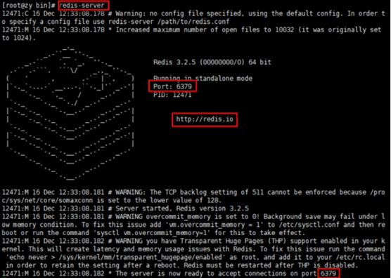

## 安装redis

### 安装步骤：

1. 准备工作 :**下载安装最新版的gcc编译器**

**安装C 语言的编译环境**

``` shell
yum install centos-release-scl scl-utils-build

yum install -y devtoolset-8-toolchain

scl enable devtoolset-8 bash
```

**测试 gcc版本** 

```shell
gcc -version
```

2. **下载redis-6.2.1.tar.gz放/opt目录**

3. **解压命令：**

```shell 
tar -zxvf redis-6.2.1.tar.gz
```

4. **解压完成后进入目录**

```shell
cd redis-6.2.1
```

5. **在redis-6.2.1目录下再次执行make命令（只是编译好）**

6. **如果没有准备好C语言编译环境，make 会报错—Jemalloc/jemalloc.h：没有那个文件**

7. **解决方案：运行make distclean**

8. **在redis-6.2.1目录下再次执行make命令（只是编译好）**

9. **跳过make test 继续执行: make install**


### 安装目录：/usr/local/bin

```shell
查看默认安装目录：
redis-benchmark:性能测试工具，可以在自己本子运行，看看自己本子性能如何

redis-check-aof：修复有问题的AOF文件，rdb和aof后面讲

redis-check-dump：修复有问题的dump.rdb文件

redis-sentinel：Redis集群使用

redis-server：Redis服务器启动命令

redis-cli：客户端，操作入口

```


### 前台启动（不推荐）

```shell
redis-server
```





### 后台启动

1. 修改**redis.conf(128行)**文件将里面的**daemonize no **改成 **yes**，让服务在后台启动

2. 启动redis

   ```shell
   redis-server redis.conf
   ```

3. 客户端访问

   ```shell
   redis-cli
   ```

4. 多客户端

   ```shell
   redis-cli -p 6379
   ```

5. 关闭redis

   单实例

   ```shell
   redis-cli shutdown
   或者
   127.0.0.1:6379> shutdown
   ```

   多实例

   ```shell
   redis-cli -p 6379 shutdown
   ```

## **常用五大数据类型**

### 1.Redis键（key)

```shell
keys *查看当前库所有key    (匹配：keys *1)

exists key判断某个key是否存在

type key 查看你的key是什么类型

del key       删除指定的key数据

unlink key   根据value选择非阻塞删除
仅将keys从keyspace元数据中删除，真正的删除会在后续异步操作。

expire key 10   10秒钟：为给定的key设置过期时间

ttl key 查看还有多少秒过期，-1表示永不过期，-2表示已过期

select 命令切换数据库

dbsize 查看当前数据库的key的数量

flushdb 清空当前库

flushall 通杀全部库
```

### 2.字符串（String）

String的数据结构为简单动态字符串(Simple Dynamic String,缩写SDS)。是可以修改的字符串，内部结构实现上类似于Java的ArrayList，采用预分配冗余空间的方式来减少内存的频繁分配.

```shell
set   <key><value> 添加键值对

get   <key> 查询对应键值

append  <key><value> 将给定的<value> 追加到原值的末尾

strlen  <key> 获得值的长度

setnx  <key><value> 只有在 key 不存在时    设置 key 的值

incr  <key>
将 key 中储存的数字值增1
只能对数字值操作，如果为空，新增值为1

decr  <key>
将 key 中储存的数字值减1
只能对数字值操作，如果为空，新增值为-1

incrby/decrby  <key><步长> 将 key 中储存的数字值增减。自定义步长

mset  <key1><value1><key2><value2>  ..... 
同时设置一个或多个 key-value对  

mget  <key1><key2><key3> .....
同时获取一个或多个 value  

msetnx <key1><value1><key2><value2>  ..... 
同时设置一个或多个 key-value 对，当且仅当所有给定 key 都不存在。

getrange  <key><起始位置><结束位置>
获得值的范围，类似java中的substring，前包，后包

setrange  <key><起始位置><value>
用 <value>  覆写<key>所储存的字符串值，从<起始位置>开始(索引从0开始)。

setex  <key><过期时间><value>
设置键值的同时，设置过期时间，单位秒。

getset <key><value>
以新换旧，设置了新值同时获得旧值。
```

